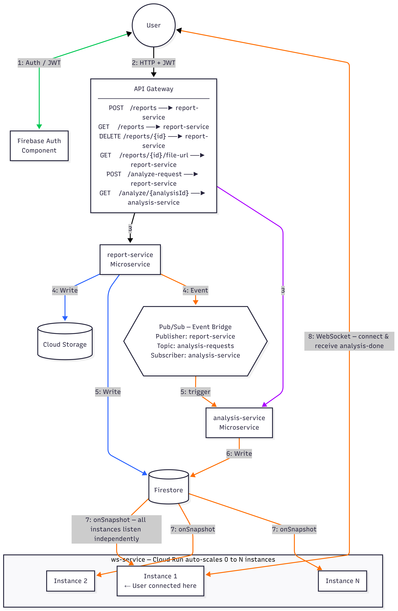

# Medical Lab Analyzer - GCP Cloud Infrastructure

[](https://cloud.google.com/run)
[](https://www.terraform.io/)
[](https://cloud.google.com/build)
[](https://firebase.google.com/)
[](https://nodejs.org/)
[](https://www.docker.com/)
[](https://cloud.google.com/firestore)
[](https://cloud.google.com/pubsub)

## SWE455 Course Project

**Course:** SWE 455: Cloud Applications Engineering  
**Term:** 252 (Spring 2026)  
**Due:** May 2, 2026

### Team Members

- Budoor Basaleh
- Aishah Algharib

---

## Project Overview

A cloud-native medical lab analyzer application demonstrating enterprise-grade cloud application development on Google Cloud Platform, following the **15-Factor Application Methodology**.

Users can upload medical lab reports, manually enter blood test values, and receive instant health analysis with recommendations - delivered in real-time via WebSocket.

### GitHub Organization: `medlab-analyzer-gcp`

This project is split across **5 independent repositories**, each with its own CI/CD pipeline:

| Repository                            | Purpose                                           | Technology      |
| ------------------------------------- | ------------------------------------------------- | --------------- |
| **medlab-infrastructure** (this repo) | Terraform IaC, deployment scripts, documentation  | Terraform, PS1  |
| **medlab-report-service**             | File upload, report management, Pub/Sub publisher | Node.js, Docker |
| **medlab-analysis-service**           | Lab analysis engine, Pub/Sub subscriber           | Node.js, Docker |
| **medlab-ws-service**                 | WebSocket server for real-time notifications      | Node.js, Docker |
| **medlab-frontend**                   | React SPA with Firebase Auth                      | React, Vite     |

Each service repository contains its own `cloudbuild.yaml` for automated CI/CD on push to main.

---

## Architecture



### Services

| Service              | Platform          | Responsibility                                                      |
| -------------------- | ----------------- | ------------------------------------------------------------------- |
| **report-service**   | Cloud Run         | Upload files, manage reports, publish to Pub/Sub                    |
| **analysis-service** | Cloud Run         | Subscribe to Pub/Sub, analyze blood tests, update Firestore         |
| **ws-service**       | Cloud Run         | WebSocket server, listens to Firestore onSnapshot, pushes to client |
| **API Gateway**      | GCP API Gateway   | Single entry point for all HTTP requests                            |
| **Firestore**        | GCP Firestore     | Report metadata and analysis results                                |
| **Cloud Storage**    | GCP Cloud Storage | PDF and image file storage                                          |
| **Firebase Auth**    | Firebase          | User authentication (JWT tokens)                                    |
| **Pub/Sub**          | GCP Pub/Sub       | Event bus between report-service and analysis-service               |

### Cloud Build CI/CD

Each repository has its own Cloud Build trigger configured via Terraform:

```terraform
# Defined in terraform/cloudbuild-triggers.tf
medlab-infrastructure-trigger   → medlab-infrastructure
medlab-report-service-trigger   → medlab-report-service
medlab-analysis-service-trigger → medlab-analysis-service
medlab-ws-service-trigger       → medlab-ws-service
medlab-frontend-trigger         → medlab-frontend
```

On push to `main`, Cloud Build automatically builds Docker images and deploys to Cloud Run.

### Flow

**Upload Path:**

```
1. User uploads PDF → API Gateway → report-service → Cloud Storage + Firestore
```

**Analyze Path:**

```
1. User clicks Analyze → browser opens WebSocket directly to ws-service
2. ws-service sets up Firestore onSnapshot listener for this user
3. ws-service confirms "subscribed" → browser calls POST /analyze-request
4. API Gateway → report-service → publishes event to Pub/Sub
5. Pub/Sub triggers analysis-service → analyzes blood test values
6. analysis-service writes results + status "analyzed" to Firestore
7. Firestore onSnapshot fires on all ws-service instances
8. The instance holding the user's WebSocket pushes "analysis-done"
9. Browser receives event → History page updates instantly, no refresh needed
```

**Get Results Path:**

```
1. User clicks View Results → GET /analyze/{analysisId} → API Gateway → analysis-service → Firestore
```

---

## 15-Factor Compliance

| Factor               | Implementation                                                                                                                 |
| -------------------- | ------------------------------------------------------------------------------------------------------------------------------ |
| 1. Codebase          | 5 independent Git repositories, one per service/infrastructure                                                                 |
| 2. Dependencies      | `package.json` + `package-lock.json` + Docker containers                                                                       |
| 3. Configuration     | Environment variables via Terraform and `.env` files                                                                           |
| 4. Backing Services  | Firestore, Cloud Storage, Pub/Sub - all configurable and swappable                                                             |
| 5. Build/Release/Run | Cloud Build CI/CD - automated build and deploy on push to main                                                                 |
| 6. Processes         | Stateless Cloud Run services (containers can be destroyed/recreated anytime)                                                   |
| 7. Port Binding      | Self-contained Express HTTP servers, port binding via environment variable                                                     |
| 8. Concurrency       | Cloud Run auto-scaling (0-100 instances per service); ws-service scales horizontally via Firestore onSnapshot                  |
| 9. Disposability     | Node.js/Express container is ready to serve requests in <5s after Cloud Run launches it; handles SIGTERM for graceful shutdown |
| 10. Dev/Prod Parity  | Same Terraform code, different `.tfvars` files (dev/prod)                                                                      |
| 11. Logs             | Winston logger → stdout → Cloud Logging (structured JSON logs)                                                                 |
| 12. Admin Processes  | One-off scripts (`deploy.ps1`, `destroy.ps1`) and Cloud Build runs as isolated, stateless processes                            |
| 13. API First        | RESTful APIs with OpenAPI 2.0 spec, API Gateway enforces contract                                                              |
| 14. Telemetry        | Cloud Logging + Cloud Monitoring + health endpoints (`/health`)                                                                |
| 15. Auth/Authz       | Firebase Auth (user authentication) + GCP IAM (service accounts and permissions)                                               |

**Full Documentation:** See [docs/15-FACTOR-COMPLIANCE.md](docs/15-FACTOR-COMPLIANCE.md) for detailed implementation evidence and code examples.

---

## Technology Stack

### Infrastructure & Platform

- **Cloud Platform:** Google Cloud Platform (GCP)
- **IaC:** Terraform
- **Container Orchestration:** Cloud Run (serverless containers)
- **CI/CD:** Cloud Build with GitHub triggers
- **Container Registry:** Artifact Registry

### Backend Services

- **Runtime:** Node.js 20
- **Framework:** Express.js
- **Logging:** Winston
- **Authentication:** Firebase Auth (JWT validation)
- **Language:** JavaScript (ES6+)

### Data & Messaging

- **Database:** Cloud Firestore (NoSQL document store)
- **File Storage:** Cloud Storage
- **Message Queue:** Cloud Pub/Sub (event-driven architecture)
- **Real-time:** WebSocket (ws package) + Firestore onSnapshot

### Frontend

- **Framework:** React 18
- **Build Tool:** Vite
- **Auth:** Firebase Authentication
- **HTTP Client:** Fetch API
- **WebSocket:** Native WebSocket API

### API & Networking

- **API Gateway:** GCP API Gateway (OpenAPI 2.0)
- **Protocol:** HTTPS (REST) + WebSocket (WS)
- **CORS:** Enabled on all services

---

## Quick Start

### Prerequisites

- Google Cloud account with billing enabled
- `gcloud` CLI installed and authenticated
- Terraform v1.0+
- Node.js 20+
- Git

### Initial Setup

**1. Clone All Repositories**

Clone all 5 repositories from the `medlab-analyzer-gcp` GitHub organization:

```powershell
# Create project directory
mkdir medlab-project
cd medlab-project

# Clone all repositories
git clone https://github.com/medlab-analyzer-gcp/medlab-infrastructure.git
git clone https://github.com/medlab-analyzer-gcp/medlab-report-service.git
git clone https://github.com/medlab-analyzer-gcp/medlab-analysis-service.git
git clone https://github.com/medlab-analyzer-gcp/medlab-ws-service.git
git clone https://github.com/medlab-analyzer-gcp/medlab-frontend.git
```

**2. Configure GCP Project**

```powershell
# Set your GCP project ID
gcloud config set project YOUR-PROJECT-ID

# Enable required APIs
gcloud services enable \
  run.googleapis.com \
  artifactregistry.googleapis.com \
  cloudbuild.googleapis.com \
  firestore.googleapis.com \
  storage.googleapis.com \
  pubsub.googleapis.com \
  apigateway.googleapis.com \
  servicemanagement.googleapis.com \
  servicecontrol.googleapis.com
```

**3. Update Terraform Configuration**

Edit `medlab-infrastructure/terraform/environments/dev.tfvars`:

```hcl
project_id  = "YOUR-PROJECT-ID"
environment = "dev"
region      = "us-central1"
```

**4. Deploy Infrastructure**

From the `medlab-infrastructure` directory:

**Windows (PowerShell):**

```powershell
.\scripts\deploy.ps1 -ProjectId "YOUR-PROJECT-ID"
```

**Linux/Mac:**

```bash
chmod +x scripts/*.sh
./scripts/deploy.sh YOUR-PROJECT-ID
```

This script will:

- Initialize Terraform
- Apply infrastructure (Cloud Run, Firestore, Storage, Pub/Sub, API Gateway)
- Create Cloud Build triggers for all 5 repositories
- Output API Gateway URL and WS Service URL

Deployment takes approximately **10-15 minutes**.

**5. Configure Frontend**

After infrastructure deployment, update the frontend environment:

```powershell
cd ../medlab-frontend
cp .env.example .env
```

Edit `.env` with values from Terraform output:

```env
# Firebase credentials (from Firebase Console)
VITE_FIREBASE_API_KEY=...
VITE_FIREBASE_AUTH_DOMAIN=...
VITE_FIREBASE_PROJECT_ID=...
VITE_FIREBASE_STORAGE_BUCKET=...
VITE_FIREBASE_MESSAGING_SENDER_ID=...
VITE_FIREBASE_APP_ID=...

# From Terraform outputs
VITE_API_GATEWAY_URL=<terraform output api_gateway_url>
VITE_WS_SERVICE_URL=<terraform output ws_service_url>
```

**6. Run Frontend Locally**

```powershell
npm install
npm run dev
# Visit http://localhost:5173
```

### Automated Deployments

Once Cloud Build triggers are configured, any push to `main` branch in service repositories will automatically:

1. Build Docker image
2. Push to Artifact Registry
3. Deploy to Cloud Run

**Trigger a deployment:**

```bash
cd medlab-report-service
git commit -m "Update service"
git push origin main
# Cloud Build automatically deploys
```

---

## Repository Structure

This repository (`medlab-infrastructure`) contains only infrastructure code and deployment scripts:

```
medlab-infrastructure/
├── terraform/
│   ├── main.tf                    # Cloud Run, Firestore, Storage, IAM
│   ├── pubsub.tf                  # Pub/Sub topics and subscriptions
│   ├── api-gateway.tf             # API Gateway configuration
│   ├── api-spec.yaml              # OpenAPI 2.0 specification
│   ├── cloudbuild-triggers.tf     # CI/CD trigger definitions (5 triggers)
│   ├── variables.tf
│   ├── outputs.tf
│   ├── provider.tf
│   └── environments/
│       ├── dev.tfvars             # Dev environment config
│       └── prod.tfvars            # Prod environment config
│
├── scripts/
│   ├── deploy.ps1                 # Full deployment (Windows)
│   ├── deploy.sh                  # Full deployment (Linux/Mac)
│   ├── destroy.ps1                # Infrastructure teardown (Windows)
│   └── destroy.sh                 # Infrastructure teardown (Linux/Mac)
│
├── docs/
│   ├── 15-FACTOR-COMPLIANCE.md    # Complete 15-Factor methodology documentation
│   ├── API.md                     # Complete API reference
│   └── architecture.png           # System architecture diagram (if exists)
│
├── cloudbuild.yaml                # CI/CD for infrastructure repo
├── AI_DEVELOPMENT_LOG.md          # AI usage transparency log
└── README.md                      # This file
```

### Service Repositories

Each service has its own repository with this structure:

**medlab-report-service/**

```
├── src/                           # Source code
├── Dockerfile                     # Container definition
├── cloudbuild.yaml                # Auto-deploy on push to main
├── package.json                   # Dependencies
├── index.js                       # Main server file
└── README.md
```

**medlab-analysis-service/**

```
├── src/                           # Source code + analyzer logic
├── Dockerfile
├── cloudbuild.yaml
├── package.json
├── index.js
└── README.md
```

**medlab-ws-service/**

```
├── src/                           # WebSocket handlers
├── Dockerfile
├── cloudbuild.yaml
├── package.json
├── index.js
└── README.md
```

**medlab-frontend/**

```
├── src/
│   ├── pages/                     # Upload, History, Analyze
│   ├── components/                # Reusable UI components
│   ├── utils/
│   │   ├── api.js                 # API Gateway client
│   │   └── socketManager.js       # WebSocket connection manager
│   ├── contexts/                  # React contexts (Auth)
│   ├── firebase.js                # Firebase initialization
│   └── gcp-config.js              # GCP endpoints
├── public/
├── .env.example                   # Environment template
├── vite.config.js
├── package.json
└── README.md
```

---

## Why a Deploy Script Alongside Terraform?

All cloud infrastructure in this project is provisioned by Terraform — Cloud Run, Firestore, Cloud Storage, Pub/Sub, API Gateway, IAM, and Firebase Auth. However, three bootstrap tasks **cannot** be expressed in Terraform and must be handled by the deploy script:

**1. Enabling bootstrap APIs (`gcloud services enable`)**

Terraform needs `cloudresourcemanager.googleapis.com` enabled before it can communicate with GCP at all. You cannot use Terraform to enable the very APIs that Terraform needs to start — so the script enables them first as a one-time bootstrap. Terraform then re-declares and manages them going forward.

**2. Creating the Terraform state bucket (`gsutil mb`)**

Terraform stores its state (a record of every resource it manages) in a GCS bucket. This bucket must exist before `terraform init` can run. It is a fundamental limitation of Terraform: you cannot use Terraform to create its own state backend. This bootstrap step is universally accepted practice across all Terraform projects.

**3. Triggering the first Cloud Build run (`gcloud builds triggers run`)**

Terraform is **declarative** — it manages what *exists*, not what *runs*. The Cloud Build triggers are fully defined and managed by Terraform, but actually firing them is an imperative action with no Terraform equivalent. On a fresh deployment there is no git push to trigger the pipeline automatically, so the script fires the triggers once to build and deploy the real Docker images.

Everything else — infrastructure creation, configuration, IAM, networking — is handled exclusively by Terraform.

---

## Infrastructure Management

### Deploy/Update Infrastructure

```powershell
cd medlab-infrastructure
.\scripts\deploy.ps1 -ProjectId "YOUR-PROJECT-ID"
```

### Destroy Everything

**Warning:** This will delete all resources including Cloud Run services, Firestore data, and Cloud Storage buckets.

```powershell
cd medlab-infrastructure
.\scripts\destroy.ps1 -ProjectId "YOUR-PROJECT-ID" -Force
```

### Check Deployment Status

```powershell
# List all Cloud Run services
gcloud run services list --region=us-central1 --project=YOUR-PROJECT-ID

# Check Cloud Build triggers
gcloud builds triggers list --project=YOUR-PROJECT-ID

# View recent builds
gcloud builds list --project=YOUR-PROJECT-ID --limit=10
```

---

## Documentation

| Document                                                             | Description                                   |
| -------------------------------------------------------------------- | --------------------------------------------- |
| [15-FACTOR-COMPLIANCE.md](docs/15-FACTOR-COMPLIANCE.md)              | Complete 15-Factor methodology implementation |
| [API.md](docs/API.md)                                                | Full API reference with examples              |
| [AI_DEVELOPMENT_LOG.md](AI_DEVELOPMENT_LOG.md)                       | Transparent AI usage log                      |
| [terraform/cloudbuild-triggers.tf](terraform/cloudbuild-triggers.tf) | CI/CD trigger definitions                     |

---

## AI Development Transparency

This project was developed with assistance from **Claude Code (Claude Sonnet 4.6) by Anthropic** as a learning tool, in accordance with academic integrity guidelines.

### AI Usage

**What AI Helped With:**

- Initial Terraform configuration structure
- Cloud Build CI/CD pipeline setup
- Debugging deployment issues (PowerShell, gcloud commands)
- Code structure and best practices
- Documentation formatting

**What We Did:**

- All design decisions (architecture, service separation, event-driven design)
- Understanding cloud concepts and implementing 15-Factor methodology
- Testing and iterating on the implementation

### Full Transparency Log

See [AI_DEVELOPMENT_LOG.md](AI_DEVELOPMENT_LOG.md) for:

- Complete log of all AI interactions
- Questions asked and answers received
- Problems encountered and how they were solved
- What was learned from each interaction
