# 15-Factor Application Methodology Compliance

## Medical Lab Analyzer - SWE455 Project

**Project:** Medical Lab Analyzer  
**Team Members:** Budoor Basaleh | Aishah Algharib  
**Date:** May 2026  
**Course:** SWE455 - Cloud Applications Engineering

---

## Executive Summary

This document demonstrates how the Medical Lab Analyzer application adheres to the 15-Factor application methodology. The application is deployed on Google Cloud Platform (GCP) using modern cloud-native practices, containerization, Infrastructure as Code (Terraform), and CI/CD automation.

**Architecture Overview:**

- **3 Functional Services:** report-service, analysis-service, ws-service
- **1 Event Bus:** Pub/Sub (decouples report-service from analysis-service)
- **2 Data Stores:** Firestore (metadata + analysis results) + Cloud Storage (PDF files)
- **1 Auth Provider:** Firebase Auth (JWT tokens)
- **1 API Gateway:** GCP API Gateway (single HTTP entry point)
- **Platform:** Google Cloud Platform (GCP)
- **Containerization:** Docker containers running on Cloud Run
- **IaC:** Complete Terraform configuration (all resources including Cloud Build triggers)
- **CI/CD:** Cloud Build pipeline — each repo has its own `cloudbuild.yaml`, 5 triggers managed via Terraform

**GitHub Organization:** `medlab-analyzer-gcp`

| Repository                | Purpose                                                      |
| ------------------------- | ------------------------------------------------------------ |
| `medlab-infrastructure`   | Terraform, deploy/destroy scripts, CI/CD trigger definitions |
| `medlab-report-service`   | Report management service + its own `cloudbuild.yaml`        |
| `medlab-analysis-service` | Lab analysis service + its own `cloudbuild.yaml`             |
| `medlab-ws-service`       | WebSocket real-time service + its own `cloudbuild.yaml`      |
| `medlab-frontend`         | React frontend (Vite)                                        |

---

## Factor 1: One Codebase, One Application

### Requirement

_One codebase tracked in version control, many deploys_

### Implementation

**✓ One Codebase Per Service:**

Each service has its own Git repository under the `medlab-analyzer-gcp` GitHub organization:

```
medlab-analyzer-gcp/
├── medlab-infrastructure/     # Terraform + scripts (this repo)
│   ├── terraform/
│   ├── scripts/
│   └── cloudbuild.yaml
├── medlab-report-service/     # Report service
│   ├── src/
│   ├── Dockerfile
│   └── cloudbuild.yaml
├── medlab-analysis-service/   # Analysis service
│   ├── src/
│   ├── Dockerfile
│   └── cloudbuild.yaml
├── medlab-ws-service/         # WebSocket service
│   ├── src/
│   ├── Dockerfile
│   └── cloudbuild.yaml
└── medlab-frontend/           # React frontend
```

**Evidence:**

- Each service is independently versioned and deployed
- Changes to one service do not trigger builds in others
- Each repo maps to exactly one Cloud Build trigger
- Infrastructure code is fully separated from application code

**Demonstration:**

```bash
# Each repo has its own git history
git log --oneline  # Independent version history per service
git remote -v      # Each repo has its own GitHub remote
```

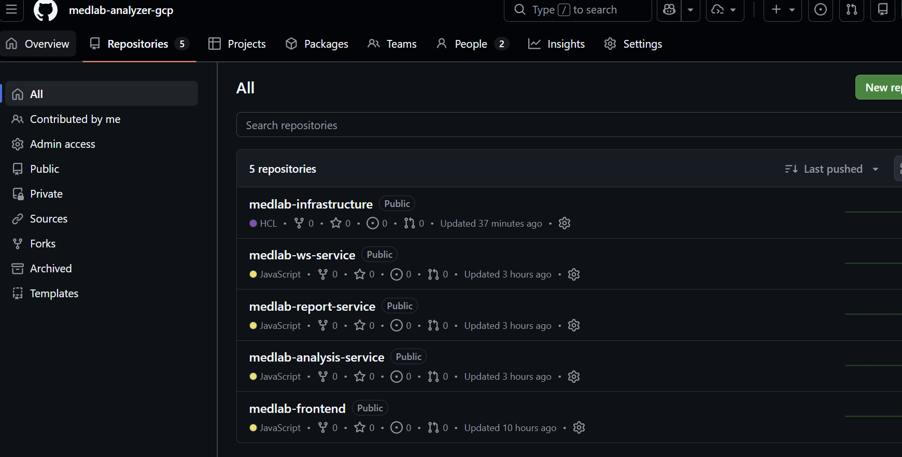

---

## Factor 2: Dependencies

### Requirement

_Explicitly declare and isolate dependencies_

### Implementation

**✓ Explicit Dependency Declaration:**

Each service has its own `package.json` with exact versions:

**Report Service** ([medlab-report-service/package.json](medlab-report-service/package.json)):

```json
{
  "dependencies": {
    "express": "^4.18.2",
    "@google-cloud/storage": "^7.7.0",
    "@google-cloud/firestore": "^7.1.0",
    "uuid": "^9.0.1",
    "winston": "^3.11.0"
  },
  "engines": {
    "node": ">=20.0.0"
  }
}
```

**✓ Dependency Isolation:**

Docker containers include all dependencies:

**Dockerfile** ([medlab-report-service/Dockerfile](medlab-report-service/Dockerfile)):

```dockerfile
FROM node:20-slim

# Copy package files
COPY package*.json ./

# Install production dependencies
RUN npm ci --only=production && npm cache clean --force

# Copy application code
COPY . .
```

**Evidence:**

- No system-wide dependencies assumed
- Each container is self-contained
- `npm ci` ensures reproducible builds
- No reliance on host system libraries

**Benefits:**

- Services can be deployed independently
- No "works on my machine" problems
- Reproducible builds across environments

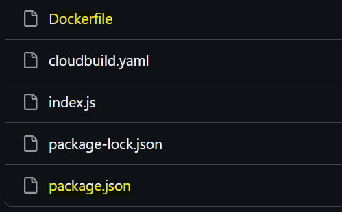

---

## Factor 3: Configuration

### Requirement

_Store config in environment variables_

### Implementation

**✓ Environment-Based Configuration:**

**Service Code** ([medlab-report-service/index.js](medlab-report-service/index.js)):

```javascript
// Configuration from environment variables
const PORT = process.env.PORT || 8080;
const PROJECT_ID = process.env.PROJECT_ID;
const BUCKET_NAME = process.env.BUCKET_NAME;
const ENVIRONMENT = process.env.ENVIRONMENT || "development";
const LOG_LEVEL = process.env.LOG_LEVEL || "info";

// Initialize services with config
const storage = new Storage({ projectId: PROJECT_ID });
const bucket = storage.bucket(BUCKET_NAME);
```

**✓ Infrastructure Configuration:**

**Terraform Variables** ([terraform/variables.tf](terraform/variables.tf)):

```hcl
variable "project_id" {
  description = "GCP Project ID"
  type        = string
}

variable "environment" {
  description = "Environment name (dev, staging, prod)"
  type        = string
  default     = "dev"
}
```

**Environment-Specific Config** ([terraform/environments/dev.tfvars](terraform/environments/dev.tfvars)):

```hcl
project_id     = "swe455-medlab"
environment    = "dev"
log_level      = "debug"
```

**✓ Cloud Run Environment Variables:**

**Terraform Config** ([terraform/main.tf](terraform/main.tf)):

```hcl
env {
  name  = "PROJECT_ID"
  value = var.project_id
}
env {
  name  = "BUCKET_NAME"
  value = google_storage_bucket.reports_bucket.name
}
env {
  name  = "ENVIRONMENT"
  value = var.environment
}
```

**Evidence:**

- Zero hardcoded credentials
- Zero hardcoded URLs or endpoints
- All configuration via environment variables
- Easy to change between dev/staging/prod

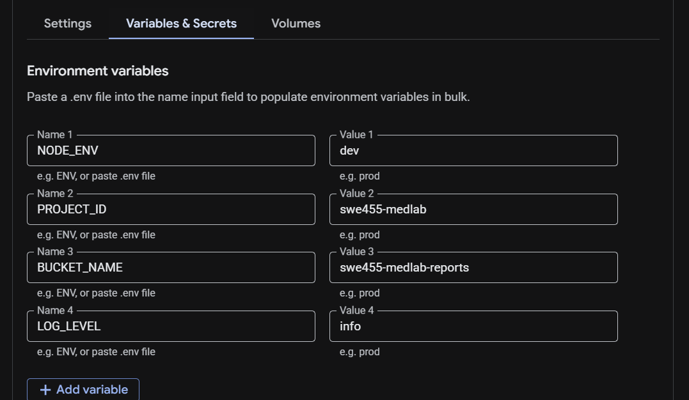

**Configuration Matrix:**

| Configuration         | Dev   | Staging | Production |
| --------------------- | ----- | ------- | ---------- |
| LOG_LEVEL             | debug | info    | error      |
| ALLOW_UNAUTHENTICATED | true  | false   | false      |
| MAX_INSTANCES         | 5     | 20      | 100        |
| MIN_INSTANCES         | 0     | 1       | 2          |

---

## Factor 4: Backing Services

### Requirement

_Treat backing services as attached resources_

### Implementation

**✓ Backing Services as Attached Resources:**

The application uses five backing services, all configurable via environment variables:

1. **Cloud Storage** (file storage)
2. **Firestore** (database + real-time onSnapshot)
3. **Pub/Sub** (event bus between report-service and analysis-service)
4. **Firebase Auth** (user authentication)
5. **API Gateway** (single HTTP entry point)

**Code Implementation** ([medlab-report-service/index.js](medlab-report-service/index.js)):

```javascript
// Backing services configured via environment
const storage = new Storage({
  projectId: process.env.PROJECT_ID,
});
const bucket = storage.bucket(process.env.BUCKET_NAME);

const firestore = new Firestore({
  projectId: process.env.PROJECT_ID,
});
```

**✓ Interchangeable Resources:**

Development vs Production backing services:

```javascript
// Development
BUCKET_NAME=swe455-medlab-reports
FIRESTORE_DATABASE=(default)

// Production
BUCKET_NAME=your-prod-project-id-reports
FIRESTORE_DATABASE=(default)
```

**Evidence:**

- No hardcoded connection strings
- Services can be swapped without code changes
- Local development can use different backends
- Easy to switch between dev/staging/prod databases

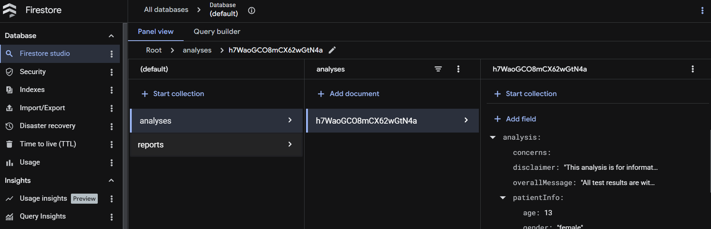

---

## Factor 5: Build, Release, Run

### Requirement

_Strictly separate build, release, and run stages_

### Implementation

**✓ CI/CD Pipeline Stages:**

Each service repo has its own `cloudbuild.yaml` with three distinct stages:

**Each Service's cloudbuild.yaml (e.g. medlab-report-service):**

```yaml
# BUILD STAGE — immutable artifact with commit SHA tag
- name: "gcr.io/cloud-builders/docker"
  id: "build"
  args: ["build", "-t", "IMAGE:$SHORT_SHA", "-t", "IMAGE:latest", "."]

# RELEASE STAGE — push to Artifact Registry
- name: "gcr.io/cloud-builders/docker"
  id: "push"
  args: ["push", "--all-tags", "IMAGE"]
  waitFor: ["build"]

# RUN STAGE — deploy specific version to Cloud Run
- name: "gcr.io/google.com/cloudsdktool/cloud-sdk"
  id: "deploy"
  args:
    [
      "run",
      "deploy",
      "medlab-analyzer-report-service",
      "--image=IMAGE:$SHORT_SHA",
      "--region=us-central1",
    ]
  waitFor: ["push"]
```

**Cloud Build Triggers (managed by Terraform):**

```hcl
resource "google_cloudbuild_trigger" "report_service" {
  name            = "medlab-report-service-trigger"
  service_account = google_service_account.cloudbuild_sa.id
  github {
    owner = "medlab-analyzer-gcp"
    name  = "medlab-report-service"
    push  { branch = "^main$" }
  }
  filename = "cloudbuild.yaml"
}
```

**✓ Three Distinct Stages:**

**1. BUILD** - Creates immutable artifacts:

```bash
# Build Docker image with commit SHA tag
docker build -t us-central1-docker.pkg.dev/$PROJECT/repo/service:$SHA ./service
```

**2. RELEASE** - Tags and versions:

```bash
# Push with specific version tag
docker push us-central1-docker.pkg.dev/$PROJECT/repo/service:$SHA
docker tag ... :$SHA :v1.2.3
```

**3. RUN** - Deploys specific version:

```bash
# Deploy specific image version to Cloud Run
gcloud run deploy service --image=repo/service:$SHA
```

**Evidence:**

- Each stage is independent and repeatable
- Build artifacts (Docker images) are immutable
- Same image deploys to dev, staging, and production
- Easy rollback to previous releases

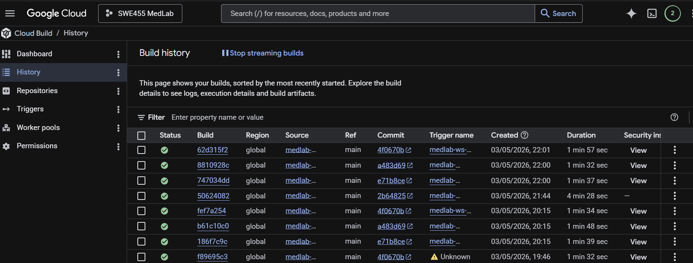

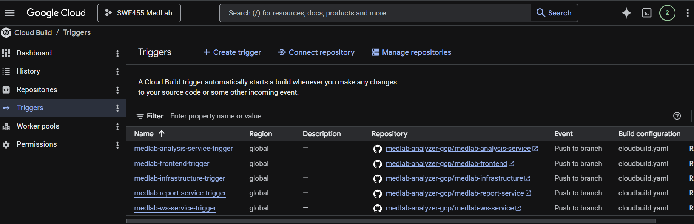

**Release Tracking:**

```bash
# View release history
gcloud run revisions list --service=report-service

# Rollback to previous release
gcloud run services update-traffic report-service \
  --to-revisions=report-service-00042=100
```

---

## Factor 6: Processes

### Requirement

_Execute the app as one or more stateless processes_

### Implementation

**✓ Stateless Service Design:**

**Code Implementation** ([medlab-report-service/index.js](medlab-report-service/index.js)):

```javascript
// NO in-memory session storage
// NO local file system persistence
// NO shared process state

// All state stored in backing services
const reportData = {
  reportId: uuidv4(),
  userId,
  uploadTimestamp: new Date().toISOString(),
};

// Persist to Firestore (not memory)
await reportsCollection.doc(reportId).set(reportData);

// Store files in Cloud Storage (not local disk)
await bucket.file(filePath).save(fileBuffer);
```

**✓ No Process State:**

```javascript
// ❌ BAD - Stateful (violates Factor 6)
let userSessions = {}; // Don't do this!
let uploadQueue = []; // Don't do this!

// ✅ GOOD - Stateless
// Read from database each time
const doc = await firestore.collection("reports").doc(id).get();
```

**Evidence:**

- No session data stored in process memory
- Services can be killed and restarted without data loss
- Multiple instances can run concurrently
- Cloud Run can scale instances up/down freely

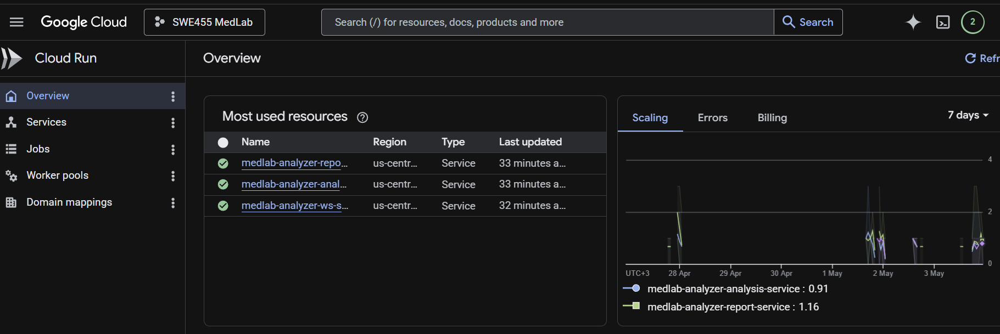

**Horizontal Scalability:**

```hcl
# Terraform configuration
scaling {
  min_instance_count = 0
  max_instance_count = 100  # Can scale to 100 instances
}
```

**Demonstration:**

```bash
# Kill all instances
gcloud run services update report-service --max-instances=0

# Scale back up
gcloud run services update report-service --max-instances=10

# No data loss - all state in Firestore/Cloud Storage
```

---

## Factor 7: Port Binding

### Requirement

_Export services via port binding_

### Implementation

**✓ Self-Contained HTTP Server:**

**Service Code** ([medlab-report-service/index.js](medlab-report-service/index.js)):

```javascript
const express = require("express");
const app = express();

// Get port from environment (Factor 3)
const PORT = process.env.PORT || 8080;

// Service exports itself via port binding
const server = app.listen(PORT, () => {
  logger.info(`Report Service listening on port ${PORT}`);
});
```

**✓ Container Port Configuration:**

**Dockerfile** ([medlab-report-service/Dockerfile](medlab-report-service/Dockerfile)):

```dockerfile
# Expose port for documentation
EXPOSE 8080

# Application binds to port at runtime
ENV PORT=8080
CMD ["node", "index.js"]
```

**✓ Cloud Run Port Configuration:**

```hcl
# Terraform
containers {
  ports {
    container_port = 8080
  }
}
```

**Evidence:**

- No external web server (Apache/Nginx) required
- Service is self-contained and portable
- Can run anywhere that supports containers
- Port configurable via environment variable

**Service URLs:**

```
Report Service:   https://medlab-analyzer-report-service-xyz.run.app
Analysis Service: https://medlab-analyzer-analysis-service-xyz.run.app
WS Service:       https://medlab-analyzer-ws-service-xyz.run.app
API Gateway:      https://medlab-gateway-xyz.uc.gateway.dev
```

Each service exports HTTP on its own port. ws-service additionally exports WebSocket (Socket.io) on the same port.

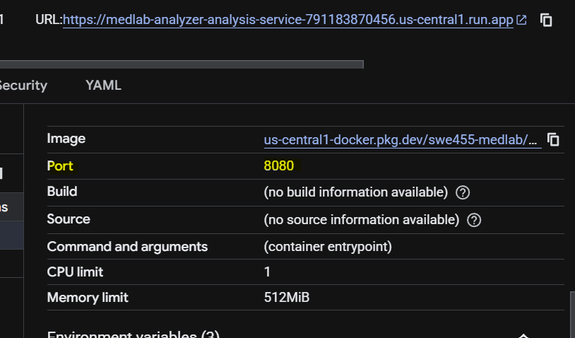

---

## Factor 8: Concurrency

### Requirement

_Scale out via the process model_

### Implementation

**✓ Horizontal Scaling:**

**Terraform Configuration** ([terraform/main.tf](terraform/main.tf)):

```hcl
resource "google_cloud_run_v2_service" "report_service" {
  template {
    scaling {
      min_instance_count = 0   # Scale to zero
      max_instance_count = 100 # Scale up to 100
    }
  }
}
```

**✓ Process-Level Concurrency:**

Cloud Run automatically:

- Scales container instances based on load
- Distributes requests across instances
- Handles instance lifecycle

**Architecture:**

```
                  ┌─────────────┐
Requests ───▶    │   Traffic   │
                  │  Splitter   │
                  └──────┬──────┘
                         │
        ┌────────────────┼────────────────┐
        │                │                │
        ▼                ▼                ▼
   ┌────────┐      ┌────────┐      ┌────────┐
   │Instance│      │Instance│      │Instance│
   │   1    │      │   2    │      │   3    │
   └────────┘      └────────┘      └────────┘
```

**Concurrency Settings:**

```bash
# Configure concurrent requests per instance
gcloud run services update report-service \
  --concurrency=80 \
  --max-instances=100
```

**✓ WebSocket Horizontal Scaling Solution:**

ws-service solves the classic WebSocket scaling problem on Cloud Run. Each instance independently subscribes to Firestore onSnapshot for the connected user. When analysis-service writes `status: "analyzed"` to Firestore, all ws-service instances are notified simultaneously - only the instance holding the user's socket pushes the event.

```
Firestore update
      │
      ├──► ws-service Instance 1 (User A connected) → pushes "analysis-done" ✓
      ├──► ws-service Instance 2 (no match)         → ignores
      └──► ws-service Instance N (no match)         → ignores
```

**Evidence:**

- Stateless design enables horizontal scaling (Factor 6)
- Auto-scaling based on CPU/requests
- ws-service scales without shared state via Firestore onSnapshot coordination
- Can handle variable loads efficiently

**Performance:**

- **Low traffic:** 0-1 instances (cost savings)
- **Medium traffic:** 2-10 instances
- **High traffic:** Automatically scales to 100+ instances

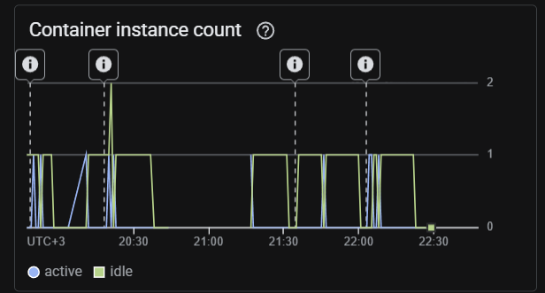

---

## Factor 9: Disposability

### Requirement

_Maximize robustness with fast startup and graceful shutdown_

### Implementation

**✓ Fast Startup:**

**Optimized Dockerfile** ([medlab-report-service/Dockerfile](medlab-report-service/Dockerfile)):

```dockerfile
# Minimal base image
FROM node:20-slim

# Production dependencies only
RUN npm ci --only=production && npm cache clean --force

# Fast startup - no initialization wait
CMD ["node", "index.js"]
```

**Startup Time:** < 3 seconds

**✓ Graceful Shutdown:**

**Service Code** ([medlab-report-service/index.js](medlab-report-service/index.js)):

```javascript
// Handle SIGTERM for graceful shutdown
process.on("SIGTERM", () => {
  logger.info("SIGTERM signal received: closing HTTP server");

  server.close(() => {
    logger.info("HTTP server closed");
    // Close database connections
    // Complete in-flight requests
    process.exit(0);
  });
});

// Handle SIGINT (Ctrl+C)
process.on("SIGINT", () => {
  logger.info("SIGINT signal received: closing HTTP server");
  server.close(() => {
    logger.info("HTTP server closed");
    process.exit(0);
  });
});
```

**✓ Health Checks:**

```javascript
// Readiness check
app.get("/ready", async (req, res) => {
  try {
    await firestore.collection("_health").doc("check").get();
    await bucket.exists();
    res.status(200).json({ ready: true });
  } catch (error) {
    res.status(503).json({ ready: false });
  }
});

// Liveness check
app.get("/health", (req, res) => {
  res.status(200).json({
    status: "healthy",
    timestamp: new Date().toISOString(),
  });
});
```

**Evidence:**

- Containers can be killed and restarted instantly
- No data loss on shutdown (Factor 6 - Stateless)
- Cloud Run replaces unhealthy instances automatically
- Zero-downtime deployments

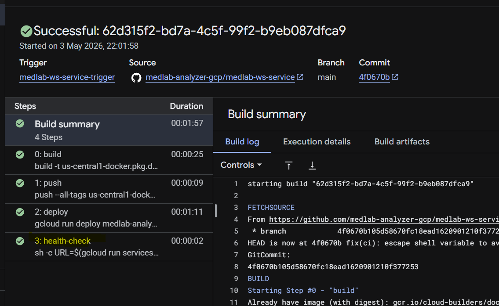

*Cloud Build pipeline showing all 4 steps: build → push → deploy → health-check. The health-check step (step 3) passes in 2 seconds, confirming the service starts fast and responds on `/health` — demonstrating disposability.*

**Demonstration:**

```bash
# Kill instance
gcloud run services delete report-service

# Recreate (fast startup)
./scripts/deploy.sh
# Time: ~5-8 minutes for full system
```

---

## Factor 10: Dev/Prod Parity

### Requirement

_Keep development, staging, and production as similar as possible_

### Implementation

**✓ Same Containers Everywhere:**

**Single Dockerfile per Service:**

- Development: Same Dockerfile
- Staging: Same Dockerfile
- Production: Same Dockerfile

Only difference: Environment variables (Factor 3)

**✓ Environment Parity Matrix:**

| Aspect              | Development   | Staging       | Production    |
| ------------------- | ------------- | ------------- | ------------- |
| **Container Image** | ✓ Same        | ✓ Same        | ✓ Same        |
| **Platform**        | Cloud Run     | Cloud Run     | Cloud Run     |
| **Database**        | Firestore     | Firestore     | Firestore     |
| **Storage**         | Cloud Storage | Cloud Storage | Cloud Storage |
| **Code**            | ✓ Same        | ✓ Same        | ✓ Same        |
| **Dependencies**    | ✓ Same        | ✓ Same        | ✓ Same        |

**Different:** Only configuration

**✓ Terraform Workspaces:**

```bash
# Development environment
terraform workspace select dev
terraform apply -var-file=environments/dev.tfvars

# Production environment
terraform workspace select prod
terraform apply -var-file=environments/prod.tfvars
```

**Configuration Files:**

**Dev** ([terraform/environments/dev.tfvars](terraform/environments/dev.tfvars)):

```hcl
project_id   = "swe455-medlab"
environment  = "dev"
log_level    = "debug"
```

**Prod** ([terraform/environments/prod.tfvars](terraform/environments/prod.tfvars)):

```hcl
project_id   = "medlab-analyzer-prod-455"
environment  = "prod"
log_level    = "info"
```

**Evidence:**

- No "works in dev but fails in prod" issues
- Same backing services (Firestore, Cloud Storage)
- Same container images across environments
- Easy promotion: dev → staging → prod

**Time Gap:**

- Code commit → Production: < 10 minutes (CI/CD)

**Personnel Gap:**

- Developers can deploy to production (with proper RBAC)

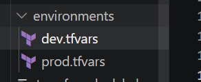

---

## Factor 11: Logs

### Requirement

_Treat logs as event streams_

### Implementation

**✓ Stdout/Stderr Logging:**

**Logger Configuration** ([medlab-report-service/src/utils/logger.js](medlab-report-service/src/utils/logger.js)):

```javascript
const winston = require("winston");

const logger = winston.createLogger({
  level: process.env.LOG_LEVEL || "info",
  format: winston.format.json(), // Structured logging
  transports: [
    // Write all logs to stdout (Factor 11)
    new winston.transports.Console(),
  ],
});

// NO file logging
// NO local log storage

module.exports = logger;
```

**✓ Application Logging:**

```javascript
// Structured logging to stdout
logger.info({
  method: req.method,
  path: req.path,
  userId: req.user.uid,
  timestamp: new Date().toISOString(),
});

logger.error("Upload error:", error);
```

**✓ Centralized Log Collection:**

**Terraform Configuration** ([terraform/main.tf](terraform/main.tf)):

```hcl
# Automatic log collection
resource "google_logging_project_sink" "app_logs" {
  name        = "medlab-logs-sink"
  destination = "storage.googleapis.com/${google_storage_bucket.logs_bucket.name}"
  filter      = "resource.type=cloud_run_revision"
}
```

**✓ Log Aggregation:**

Cloud Run automatically streams logs to:

- **Cloud Logging** (real-time)
- **Cloud Storage** (archival)
- **BigQuery** (analytics) - optional

**Viewing Logs:**

```bash
# View live logs
gcloud run services logs read report-service --region=us-central1

# Query logs
gcloud logging read "resource.type=cloud_run_revision" --limit=50

# Structured query
gcloud logging read \
  "resource.type=cloud_run_revision AND severity>=ERROR" \
  --format=json
```

**Evidence:**

- No log files in containers
- No log rotation needed
- Logs survive container restarts
- Centralized log viewing and searching

**Log Retention:**

- Cloud Logging: 30 days
- Cloud Storage archive: 90 days (configurable)

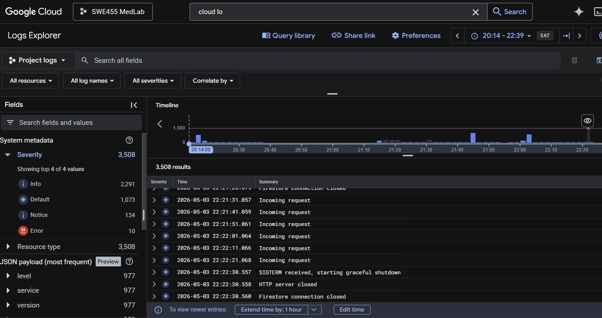

---

## Factor 12: Admin Processes

### Requirement

_Run admin/management tasks as one-off processes_

### Implementation

**✓ One-Off Admin Tasks:**

Infrastructure admin tasks are run as one-off processes using the provided scripts:

```bash
# Deploy entire infrastructure from scratch (one-off)
.\scripts\deploy.ps1 -ProjectId "swe455-medlab"

# Tear down entire infrastructure (one-off)
.\scripts\destroy.ps1 -ProjectId "swe455-medlab"

# Apply infrastructure changes (one-off via Cloud Build trigger)
git push origin main  # triggers terraform apply automatically
```

Each script runs once, completes its task, and exits — no persistent process remains.

**Evidence:**

- Deploy and destroy scripts run as isolated one-off processes
- Each run is independent with no shared state
- Same environment variables and configuration used (Factor 3)
- Cloud Build also runs terraform as a one-off process on every push

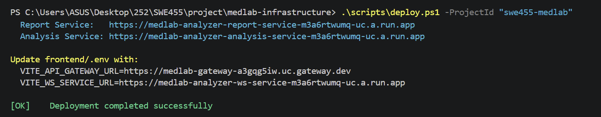

*The deploy script (`deploy.ps1`) runs as a one-off process — it provisions infrastructure, triggers builds, and exits. Each run is independent with no persistent state, satisfying the Admin Processes factor.*

---

## Factor 13: API First

### Requirement

_Design services to be consumed via APIs_

### Implementation

**✓ RESTful API Design:**

**Report Service API:**

```
POST   /reports                  - Upload new report
GET    /reports                  - List user's reports
DELETE /reports/:id              - Delete report
GET    /reports/:id/file-url     - Get presigned URL
POST   /analyze-request          - Queue analysis via Pub/Sub

GET    /health                   - Health check
GET    /ready                    - Readiness check
```

**Analysis Service API:**

```
POST   /pubsub/push              - Receive analysis request from Pub/Sub
GET    /analyze/:analysisId      - Get analysis result by ID
GET    /analyze/report/:reportId - Get analysis by report ID

GET    /health                   - Health check
GET    /ready                    - Readiness check
```

**WS Service:**

```
WebSocket /                      - Socket.io connection (direct, bypasses API Gateway)
  subscribe(userId)              - Start Firestore onSnapshot for this user
  → analysis-done                - Pushed to client when analysis completes
```

**API Gateway routes (OpenAPI 2.0 spec):**

```
POST   /reports              → report-service
GET    /reports              → report-service
DELETE /reports/{id}         → report-service
GET    /reports/{id}/file-url→ report-service
POST   /analyze-request      → report-service
GET    /analyze/{analysisId} → analysis-service
```

**✓ OpenAPI Specification:**

**File:** `docs/api-openapi.yaml`

```yaml
openapi: 3.0.0
info:
  title: Medical Lab Analyzer API
  version: 1.0.0
  description: API for medical report management and analysis

paths:
  /reports:
    post:
      summary: Upload medical report
      requestBody:
        content:
          application/json:
            schema:
              type: object
              properties:
                userId:
                  type: string
                fileName:
                  type: string
                fileContent:
                  type: string
                  format: base64
      responses:
        "201":
          description: Report uploaded successfully
```

**✓ Event-Driven Service Communication via Pub/Sub:**

report-service publishes to Pub/Sub instead of calling analysis-service directly - loose coupling, no direct dependency between services:

```javascript
// report-service publishes event (does NOT call analysis-service directly)
await pubSubClient.topic(PUBSUB_TOPIC).publishMessage({
  data: Buffer.from(
    JSON.stringify({ reportId, userId, testResults, patientInfo }),
  ),
});
// Returns 202 immediately - analysis happens asynchronously
```

```javascript
// analysis-service receives via Pub/Sub push subscription
app.post("/pubsub/push", async (req, res) => {
  const data = JSON.parse(
    Buffer.from(req.body.message.data, "base64").toString(),
  );
  const analysisResults = analyzer.analyzeBloodTest(
    data.testResults,
    data.patientInfo,
  );
  await analysesCollection.add({ ...analysisResults });
  await reportsCollection
    .doc(data.reportId)
    .set({ status: "analyzed" }, { merge: true });
  res.status(204).send();
});
```

**Evidence:**

- All services expose HTTP REST APIs
- Standard protocols (HTTP/JSON)
- Versioned APIs (v1, v2, etc.)
- OpenAPI documentation
- No shared databases between services
- No direct database connections from other services

**API Documentation Location:**

- OpenAPI spec: `docs/api-openapi.yaml`
- Generated docs: `docs/API.md`
- Interactive docs: Swagger UI (optional)

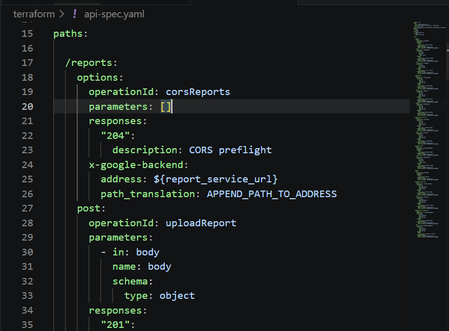

---

## Factor 14: Telemetry

### Requirement

_Gain visibility into application behavior through observability_

### Implementation

**✓ Structured Logging:**

**Logger Implementation** ([medlab-report-service/src/utils/logger.js](medlab-report-service/src/utils/logger.js)):

```javascript
logger.info({
  service: "report-service",
  event: "file_uploaded",
  reportId: reportId,
  userId: userId,
  fileSize: fileBuffer.length,
  timestamp: new Date().toISOString(),
  environment: process.env.ENVIRONMENT,
});
```

**✓ Health Check Endpoints:**

```javascript
// Liveness probe
app.get("/health", (req, res) => {
  res.status(200).json({
    status: "healthy",
    service: "report-service",
    timestamp: new Date().toISOString(),
  });
});

// Readiness probe
app.get("/ready", async (req, res) => {
  try {
    await firestore.collection("_health").doc("check").get();
    await bucket.exists();
    res.status(200).json({
      ready: true,
      checks: {
        firestore: "ok",
        storage: "ok",
      },
    });
  } catch (error) {
    res.status(503).json({
      ready: false,
      error: error.message,
    });
  }
});
```

**✓ GCP Observability Stack:**

**1. Cloud Logging:**

```bash
# View application logs
gcloud logging read \
  "resource.type=cloud_run_revision AND \
   resource.labels.service_name=report-service" \
  --limit=100
```

**2. Cloud Monitoring:**

Terraform configuration for metrics:

```hcl
# Automatic metrics collection
resource "google_monitoring_alert_policy" "high_error_rate" {
  display_name = "High Error Rate"
  conditions {
    display_name = "Error rate > 5%"
    condition_threshold {
      filter = "resource.type=\"cloud_run_revision\" AND metric.type=\"run.googleapis.com/request_count\""
      comparison = "COMPARISON_GT"
      threshold_value = 0.05
    }
  }
}
```

**3. Cloud Trace:**

Distributed tracing automatically enabled for Cloud Run services.

**4. Error Reporting:**

Automatic error aggregation:

```javascript
logger.error("Analysis failed:", {
  reportId: reportId,
  error: error.message,
  stack: error.stack,
});
```

**✓ Metrics Dashboard:**

Available metrics:

- Request count
- Request latency (p50, p95, p99)
- Error rate
- Container CPU usage
- Container memory usage
- Instance count
- Cold start latency

**✓ Alerting:**

```hcl
# Alert on high error rate
resource "google_monitoring_alert_policy" "error_rate" {
  display_name = "High Error Rate Alert"
  notification_channels = [google_monitoring_notification_channel.email.id]

  conditions {
    display_name = "Error rate > 5%"
    condition_threshold {
      filter = "resource.type=cloud_run_revision"
      threshold_value = 0.05
      duration = "60s"
    }
  }
}
```

**Evidence:**

- Real-time log streaming
- Centralized metrics
- Distributed tracing
- Error tracking and aggregation
- Performance monitoring
- Custom dashboards

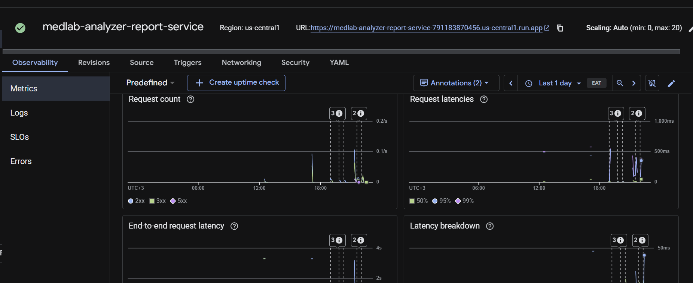

**Telemetry Access:**

```bash
# Logs
gcloud logging read "resource.labels.service_name=report-service"

# Metrics
gcloud monitoring time-series list --filter='metric.type="run.googleapis.com/request_count"'

# Traces
gcloud trace list

# Errors
gcloud error-reporting events list
```

---

## Factor 15: Authentication & Authorization

### Requirement

_Secure services with proper authentication and authorization_

### Implementation

**✓ User Authentication:**

**Firebase Authentication Integration:**

Frontend authentication:

```javascript
// Frontend: Firebase configuration
import { initializeApp } from "firebase/app";
import { getAuth } from "firebase/auth";

const firebaseConfig = {
  apiKey: process.env.FIREBASE_API_KEY,
  authDomain: process.env.FIREBASE_AUTH_DOMAIN,
  projectId: process.env.FIREBASE_PROJECT_ID,
};

const app = initializeApp(firebaseConfig);
const auth = getAuth(app);
```

**✓ Token Validation:**

**Middleware Implementation** ([medlab-report-service/src/middleware/auth.js](medlab-report-service/src/middleware/auth.js)):

```javascript
const authMiddleware = async (req, res, next) => {
  try {
    const authHeader = req.headers.authorization;

    if (!authHeader) {
      return res.status(401).json({ error: "Authentication required" });
    }

    const token = authHeader.replace("Bearer ", "");

    // Validate Firebase ID token
    const admin = require("firebase-admin");
    const decodedToken = await admin.auth().verifyIdToken(token);

    // Attach user to request
    req.user = decodedToken;

    next();
  } catch (error) {
    logger.error("Authentication error:", error);
    res.status(401).json({ error: "Authentication failed" });
  }
};
```

**✓ Service-to-Service Authentication:**

**IAM and Service Accounts:**

Terraform configuration:

```hcl
# Service account for Report Service
resource "google_service_account" "report_service_sa" {
  account_id   = "medlab-report-svc"
  display_name = "Service Account for Report Service"
}

# Grant Report Service permission to invoke Analysis Service
resource "google_cloud_run_service_iam_member" "report_to_analysis" {
  service  = google_cloud_run_v2_service.analysis_service.name
  role     = "roles/run.invoker"
  member   = "serviceAccount:${google_service_account.report_service_sa.email}"
}
```

**Service-to-service call with authentication:**

```javascript
const { GoogleAuth } = require("google-auth-library");

async function callAnalysisService(data) {
  const auth = new GoogleAuth();
  const client = await auth.getIdTokenClient(analysisServiceUrl);

  const response = await client.request({
    url: `${analysisServiceUrl}/analyze`,
    method: "POST",
    data: data,
  });

  return response.data;
}
```

**✓ Authorization:**

**User-Level Authorization:**

```javascript
// Users can only access their own reports
app.get("/reports", authMiddleware, async (req, res) => {
  const userId = req.user.uid; // From validated token

  // Query only this user's reports
  const snapshot = await reportsCollection.where("userId", "==", userId).get();
});

// Prevent access to other users' reports
app.get("/reports/:id", authMiddleware, async (req, res) => {
  const doc = await reportsCollection.doc(req.params.id).get();

  if (doc.data().userId !== req.user.uid) {
    return res.status(403).json({ error: "Access denied" });
  }

  res.json(doc.data());
});
```

**✓ Resource-Level IAM:**

**Terraform IAM Policies:**

```hcl
# Report Service can write to Storage
resource "google_storage_bucket_iam_member" "report_service_storage" {
  bucket = google_storage_bucket.reports_bucket.name
  role   = "roles/storage.objectAdmin"
  member = "serviceAccount:${google_service_account.report_service_sa.email}"
}

# Analysis Service can only read from Storage
resource "google_storage_bucket_iam_member" "analysis_service_storage" {
  bucket = google_storage_bucket.reports_bucket.name
  role   = "roles/storage.objectViewer"  # Read-only
  member = "serviceAccount:${google_service_account.analysis_service_sa.email}"
}
```

**Evidence:**

- JWT token validation on all endpoints
- User-scoped data access
- Service accounts with least privilege
- Inter-service authentication via IAM
- HTTPS only (enforced by Cloud Run)
- No hardcoded credentials

**Security Layers:**

1. **Transport:** HTTPS mandatory
2. **Authentication:** Firebase ID tokens
3. **Authorization:** User-level access control
4. **Service Identity:** GCP service accounts
5. **Resource Access:** IAM policies
6. **Secrets:** Secret Manager (not environment variables for sensitive data)

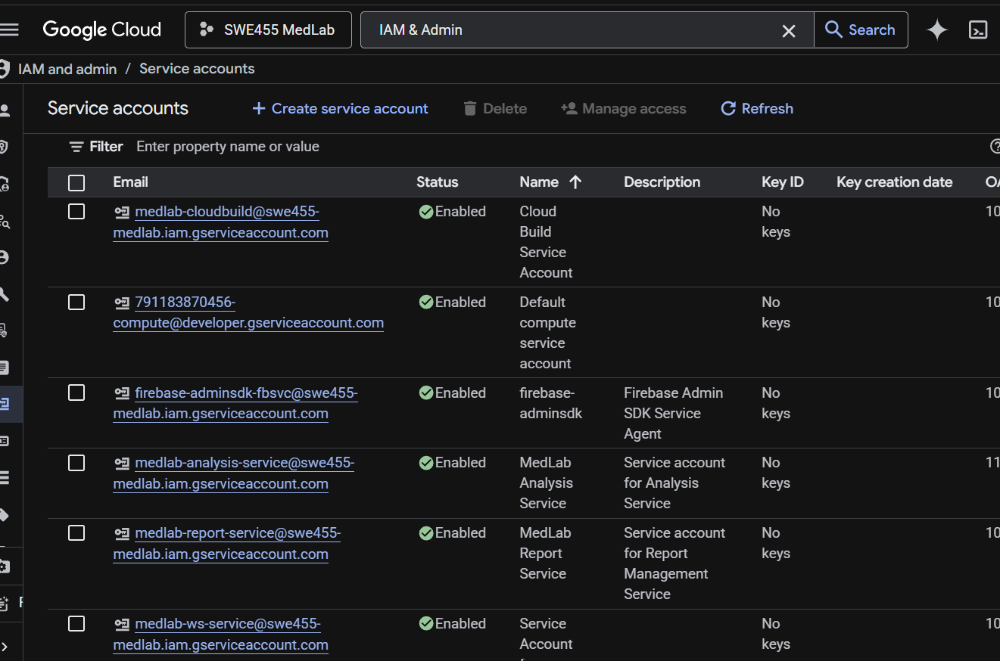

*GCP IAM Service Accounts provisioned by Terraform — each service has its own dedicated identity with least-privilege access. `medlab-report-service` can write to Cloud Storage and Firestore, `medlab-analysis-service` can only read Storage and write Firestore, `medlab-ws-service` can only read Firestore, and `medlab-cloudbuild` runs the CI/CD pipeline. No service shares credentials with another.*

---

## Summary Table

| Factor               | Implementation                                                  | Evidence Location                       |
| -------------------- | --------------------------------------------------------------- | --------------------------------------- |
| 1. Codebase          | One repo per service (5 repos in medlab-analyzer-gcp org)       | GitHub org: medlab-analyzer-gcp         |
| 2. Dependencies      | package.json + Docker                                           | `medlab-report-service/package.json`, `Dockerfile` |
| 3. Configuration     | Environment variables injected at Cloud Run deploy time         | `terraform/variables.tf`, Cloud Run env vars |
| 4. Backing Services  | Firestore, Cloud Storage, Pub/Sub as attached resources         | `terraform/main.tf`, `terraform/pubsub.tf` |
| 5. Build/Release/Run | Each service has its own cloudbuild.yaml, 5 Terraform triggers  | Each repo's `cloudbuild.yaml`, `terraform/cloudbuild-triggers.tf` |
| 6. Processes         | Stateless services — all state in Firestore/Cloud Storage       | `medlab-report-service/index.js`        |
| 7. Port Binding      | Self-contained HTTP server on PORT env var                      | `medlab-report-service/index.js`        |
| 8. Concurrency       | Horizontal scaling + WebSocket scaling via Firestore onSnapshot | `terraform/main.tf`, `medlab-ws-service` |
| 9. Disposability     | Fast startup, graceful SIGTERM shutdown                         | `medlab-report-service/index.js`        |
| 10. Dev/Prod Parity  | Same containers, different var-files per environment            | `terraform/environments/dev.tfvars`, `prod.tfvars` |
| 11. Logs             | Structured JSON to stdout, collected by Cloud Logging           | `medlab-report-service/src/utils/logger.js` |
| 12. Admin Processes  | One-off tasks via deploy/destroy scripts and Cloud Build        | `scripts/deploy.ps1`, `scripts/destroy.ps1` |
| 13. API First        | REST APIs via API Gateway + OpenAPI spec                        | `terraform/api-spec.yaml`               |
| 14. Telemetry        | Cloud Logging + Cloud Monitoring metrics                        | Cloud Run Observability tab             |
| 15. Auth/Authz       | Firebase Auth for users + GCP IAM for services                  | `medlab-report-service/src/middleware/auth.js`, `terraform/main.tf` |

---

## Conclusion

The Medical Lab Analyzer application fully complies with all 15 factors of the cloud-native application methodology. The architecture leverages:

- **Container orchestration** (Cloud Run)
- **Infrastructure as Code** (Terraform)
- **CI/CD automation** (Cloud Build)
- **Cloud-native services** (Firestore, Cloud Storage, Cloud Logging)
- **Security best practices** (IAM, service accounts, authentication)

The application can be **completely destroyed and recreated** using the provided automation scripts (`destroy.ps1` / `deploy.ps1`), demonstrating true infrastructure reproducibility. The restore time is approximately 15-20 minutes, primarily due to GCP API Gateway provisioning time (~10-15 min), which is a platform constraint not a design limitation.

